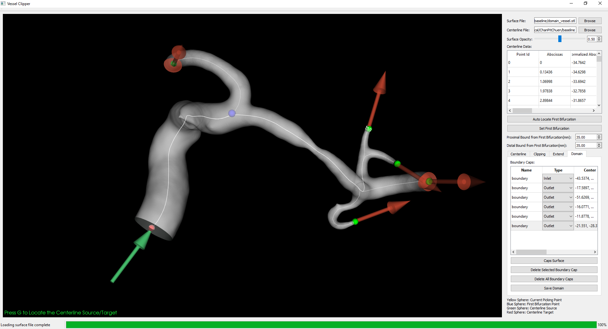

# Vessel Clipper
Clip vessel surface with user input centerlines. This repository is a GUI version of the [Vessel Centerline Extraction](https://github.com/jackyko1991/Vessel-Centerline-Extraction). Extra functions like surface clipping, domain defining are also included for CFD and morphological analysis purposes.

## Features
- Centerline and geometry calculation
- Clip user input vessel surfaces (.VTK, .VTP, .STL) with pre-defined centerline file (.VTP, .VTK).
- Clipped surface enclosing (capping)
- Output domain for CFD region definitions

## Example Usages
- Centerline Calculation
- Surface Clipping
- Boundary Extension
- Domain Define for CFD simulation

## Pre-build binary

## Build from Source
Toolchain dependency:
- MSVC 2015 **Update 3**(Windows)
- CMake 3.11 or above
- Qt 5.9 or above
- VTK 8.0
- ITK
- VMTK
- nlohmann_json(if CMake version below 3.11)

1. Complete CMake Medical Imaging Toolchain for Windows (MSVC2015).
2. nlohmann_json will be automatically fetched if CMake version is >= 3.11. Older CMake version need to use pre-built toolchain, check usage in [official repo](https://github.com/nlohmann/json).

### Known issue
- nlohmann_json is picky with C++ compilers. For MSVC 2015 users, make sure version is using Update 3.

## To-do List
- Add cylindrical clipper
- Boundary extension
- Fiducial points

## References

## Contributions